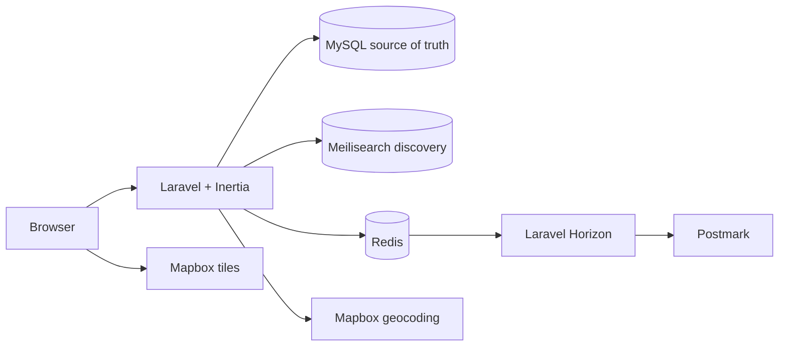

<p align="center">
  
</p>

<h1 align="center">EventRadar</h1>

<p align="center">
  Discover global events through an editorial card view or a map-based agenda.
</p>

<p align="center">
  <a href="CODING_TEST.md">Original assessment brief</a>
</p>

EventRadar is a Laravel and Inertia application built against a realistic 1.25-million-row event
catalogue. It supports event-local timezones, local image galleries, human-readable addresses,
automatic filtering, account-backed attendance, confirmation email, and durable reminders three
days and 24 hours before an event.

<p align="center">
  
</p>

<p align="center">
  
</p>

## What it does

- Offers two distinct public experiences: a card-led Discover view and a map with a chronological
  agenda.
- Applies text, category, location, and date filters automatically while keeping the complete
  database-backed feed browsable.
- Presents UTC instants in each event's IANA timezone and stores an indexed event-local date.
- Serves two or more local images per event, with 2 to 8 validated uploads for managed events.
- Lets verified users choose Interested or Going, manage their events, and cancel safely.
- Sends queued confirmation and reminder emails with signed cancellation links.
- Keeps operations separate in an authenticated admin dashboard with complete event CRUD, explicit
  pagination, address lookup, image management, and attendee lists.
- Uses Tailwind CSS and restrained transitions for state feedback, with reduced-motion support.

## Architecture



MySQL remains the presentation truth. Meilisearch is a replaceable discovery read model that
returns compact, ordered event IDs. Laravel then rechecks public visibility and hydrates explicit
page-specific data from MySQL. Admin browsing never depends on the search index.

## Key decisions

### Reproducible development with Sail

Laravel Sail runs PHP, MySQL, Redis, Meilisearch, Horizon, the scheduler, Mailpit, and Vite as one
documented development environment. A clean checkout does not need host-installed service
dependencies.

### MySQL as the source of truth

MySQL owns relational event data, indexed admin pagination, users, attendance, and the email
delivery ledger. It is a more predictable operational fit than SQLite for concurrent web, queue,
and scheduled workloads over the supplied catalogue size.

### Meilisearch as bounded discovery

Meilisearch provides typo-tolerant relevance, facets, and geographic discovery. Its configured hit
window is intentional: public search is discovery, while the default public feed and complete admin
catalogue remain MySQL-backed and fully pageable.

### Separate public, account, and admin experiences

The visual public application is designed for discovery. `/my-events` is a small attendee
workspace, and `/admin` is a deliberately practical operational interface. Administrators and
normal users are redirected to the appropriate experience after authentication.

### Explicit global time handling

Each event stores UTC start and end instants alongside an IANA timezone and the event-local calendar
date. This makes display, date filtering, rescheduling, and reminder horizons unambiguous.

### Local images at catalogue scale

Seeded events reuse sixteen curated local two-image sets rather than creating millions of files.
Admin uploads are decoded, validated, stripped of metadata, resized, and saved as local WebP
variants. The database stores ordered image records, not external URLs.

### Useful addresses without a million API calls

Seeded events use a checked-in gazetteer containing a human-readable place, coordinates, and
timezone. Managed events use deliberate permanent Mapbox geocoding and store the selected result.
No page view triggers reverse geocoding for the seed catalogue.

### Account-backed attendance and durable reminders

An account gives attendees a complete way to see, change, and cancel their choice. A revision-bound
delivery ledger records confirmation and reminder work, while Redis and Horizon process it away
from web requests. Cancellation or rescheduling invalidates stale pending work, and normal job
retries do not create a second completed ledger delivery.

### Narrow Inertia data contracts

Controllers select explicit columns and build page-specific data transfer objects. Raw source
payloads, owner details, attendee email addresses, and service credentials are never shared as
general frontend props. Small lazy lookups use Inertia's HTTP helper rather than an unrelated API
layer.

## Starting point

The supplied starter is preserved by the `starter` tag. Before extending it, I corrected several
important baseline problems:

- a misspelled filter handler and date input that did not affect the query;
- direct browser fetching and automatic infinite scrolling where intentional Inertia navigation was
  clearer;
- broad event serialization that could expose raw payload and owner data;
- a payload-driven SQLite catalogue that lacked the normalized, indexed fields needed by the final
  application.

## AI-assisted engineering workflow

I used AI agents as implementation and review tools inside a developer-controlled loop. I retained
ownership of the brief interpretation, architecture, data model, trade-offs, acceptance criteria,
code review, and final QA.

1. Inspect the brief and repository without changing code.
2. Propose and challenge architecture decisions.
3. Implement one bounded slice with explicit constraints.
4. Run an independent read-only review.
5. Inspect the diff and behavior, then accept, alter, or reject each finding.
6. Verify the slice and repeat.

Example investigation prompt:

> Read the brief and inspect the current routes, data model, and seeded workload. Do not edit any
> files. Compare the implementation with the assessment, identify scale and privacy risks,
> challenge my proposed MySQL and Meilisearch split, and give a clear recommendation.

Example implementation prompt:

> Implement only this agreed slice. Keep MySQL canonical, use explicit Inertia props, preserve the
> established visual components, and add focused regression coverage. Do not broaden the feature or
> change unrelated files.

Example review prompt:

> Review this diff read-only for correctness, privacy, realistic-data performance, and compliance
> with the brief. Give only concrete blockers with file references. Do not edit files or propose a
> broader rewrite.

## Local setup

Requirements: Docker, Composer, and free ports matching `.env.example`.

```bash
composer install
cp .env.example .env
php artisan key:generate
./vendor/bin/sail up -d
./vendor/bin/sail artisan migrate --seed
./vendor/bin/sail artisan storage:link
./vendor/bin/sail artisan events:search-index
./vendor/bin/sail npm install
./vendor/bin/sail npm run dev
```

The default `dev` profile creates 10,000 deterministic events. The local-only demo administrator is
`reviewer@example.test` with password `password`. This account exists only when
`EVENT_SEED_DEMO_ADMIN=true`, as configured in `.env.example`; production should leave it false and
create an administrator explicitly:

```bash
./vendor/bin/sail artisan user:make-admin person@example.com
```

Mailpit is available on `FORWARD_MAILPIT_DASHBOARD_PORT`. The Sail `horizon` and `scheduler`
services process confirmation and reminder work without extra terminals.

### Seed profiles

Use `smoke` for a quick 500-row reset. The explicit full profile creates 1,250,000 rows and refuses
to run without a separate acknowledgement:

```bash
./vendor/bin/sail shell -c \
  'EVENT_SEED_PROFILE=smoke php artisan migrate:fresh --seed'

./vendor/bin/sail shell -c \
  'EVENT_SEED_PROFILE=full EVENT_SEED_ALLOW_FULL=true php artisan migrate:fresh --seed'
```

Run `events:search-index` after replacing the catalogue. Normal admin changes enqueue a one-event
reconciliation and never rebuild the complete index.

### Verification

```bash
./vendor/bin/sail composer ci:check
npm run build
./vendor/bin/sail composer test:mysql
./vendor/bin/sail composer test:meilisearch
npm run test:e2e
```

The default PHP suite uses isolated SQLite databases for fast tests. The integration suites verify
the production MySQL and Meilisearch contracts through Sail.

See [the development guide](docs/development.md) for seed, database, queue, and legacy-data details.

## Environment

Start from `.env.example`. The application-specific production settings are:

- `DB_*` for MySQL 8;
- `REDIS_*`, `QUEUE_CONNECTION=redis`, and a production Horizon prefix;
- `MEILISEARCH_HOST`, `MEILISEARCH_KEY`, and `MEILISEARCH_EVENT_INDEX`;
- `VITE_MAPBOX_ACCESS_TOKEN` for a URL-restricted browser token;
- `MAPBOX_GEOCODING_TOKEN` for separate server-side permanent geocoding;
- `MAIL_MAILER=postmark`, `POSTMARK_API_KEY`, and `POSTMARK_MESSAGE_STREAM_ID`;
- `MAIL_FROM_ADDRESS` and `MAIL_FROM_NAME` for a verified Postmark sender;
- `APP_PREVENT_INDEXING=true` for the private assessment deployment;
- `SESSION_SECURE_COOKIE=true` after HTTPS is enabled;
- `TRUSTED_PROXIES` with only the actual proxy IPs or CIDRs when Cloudflare proxying is enabled.

Uploaded images use Laravel's `public` disk and require the `public/storage` symlink. The server
needs Imagick for upload validation, metadata stripping, resizing, and WebP encoding.

## Production with Forge

Create a normal Laravel site with its web root set to `public`, PHP 8.3 or newer, MySQL 8, Redis,
Imagick, and a private-network Meilisearch instance. Set production environment values before the
first deployment, including `APP_DEBUG=false` and `EVENT_SEED_DEMO_ADMIN=false`.

A repeatable deploy script can use:

```bash
composer install --no-dev --prefer-dist --optimize-autoloader
npm ci
npm run build
php artisan migrate --force
php artisan storage:link
php artisan horizon:publish
php artisan optimize
php artisan horizon:terminate
```

Enable Forge's scheduler and Horizon management. Run the initial full seed and
`events:search-index` separately from the deploy script because both are deliberate, long-running
operations. Configure Postmark with a verified sender before testing real email delivery.

## Scale validation

On the development workstation used for this assessment, the explicit full seed created 1,250,000
MySQL events in 696.68 seconds at 1,794 rows per second with 71.4 MiB peak PHP memory. The current
visibility rules projected 803,815 eligible events into Meilisearch in 81 tasks and 430.61 seconds,
then atomically promoted the temporary index. These are reproducibility measurements from one
machine, not universal production throughput claims.

The full-scale run was followed by indexed query-plan checks, public desktop and mobile browser
flows, complete admin pagination, and search reconciliation tests.

## License

EventRadar is released under the [MIT License](LICENSE).
